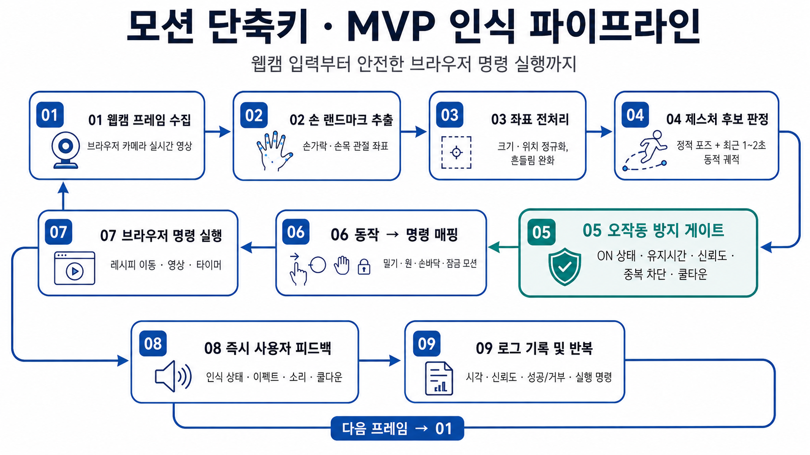

# Flickey

> 발표자의 말과 흐름을 끊지 않는 개인 맞춤형 모션 컨트롤러

Flickey는 발표자의 평소 몸짓을 미리 학습해 오작동을 줄이고, 사용자가 설정한 손동작으로 슬라이드·커서·레이저·발표 자료를 제어하는 macOS용 모션 프레젠테이션 인터페이스입니다.

단순히 손동작으로 슬라이드를 넘기는 리모컨이 아니라, 사용자가 실제 발표처럼 리허설하는 모습을 먼저 분석해 자연스러운 몸짓과 의도적인 명령을 구분하는 것을 목표로 합니다.



## 제품 정의

### 핵심 문제

- 발표 중 키보드와 마우스를 찾으면 말과 시선의 흐름이 끊깁니다.
- 기존 발표 리모컨은 슬라이드 이동 외 기능이 제한적입니다.
- 온라인 발표에서는 물리적인 레이저 포인터를 사용할 수 없습니다.
- 발표에 필요한 링크, PDF, 영상, 프로그램을 빠르게 전환하기 어렵습니다.
- 사람마다 말할 때 사용하는 몸짓이 달라 정해진 제스처는 오작동하기 쉽습니다.

### 핵심 타깃

카메라 앞에서 자료를 공유하며 자주 설명하는 온라인 발표자를 첫 번째 타깃으로 합니다.

- 온라인 강사, 교사 및 교수
- 대학생과 대학원생
- 웨비나 및 화상회의 진행자
- 비대면 영업 및 제품 시연 담당자
- 발표와 화면 공유가 많은 직장인

Zoom, Google Meet, Microsoft Teams, 온라인 강의, 웨비나, 제품 시연 및 오프라인 프로젝터 발표 환경을 우선 지원합니다.

### 핵심 가치

1. **개인별 오작동 방지**: 리허설에서 자주 사용하는 몸짓을 파악해 명령 제스처와 충돌하지 않도록 합니다.
2. **발표 흐름 유지**: 청중을 바라보면서 키보드와 마우스 없이 발표를 제어합니다.
3. **통합 제어**: 슬라이드, 커서, 레이저, 링크, 파일 및 앱을 하나의 인터페이스에서 다룹니다.
4. **사용자 맞춤 설정**: 제스처, 사용하는 손, 유지시간, 민감도와 실행 명령을 직접 설정합니다.
5. **로컬 우선 처리**: 웹캠 영상과 손 관절 정보는 기본적으로 기기 안에서 처리합니다.

## 핵심 사용자 흐름

```text
발표 프로필 생성
→ 발표 프로그램 선택
→ 발표 리허설 녹화
→ 평소 몸짓 분석
→ 충돌 위험 제스처 확인
→ 안전한 제스처 추천
→ 제스처와 명령 연결
→ 동작 테스트
→ 발표 모드 시작
→ 실시간 모션 제어
→ 발표 종료 및 인식 결과 확인
```

## 발표 리허설 학습

리허설 학습은 발표 내용이나 얼굴을 학습하기 위한 기능이 아닙니다. 사용자가 실제 발표처럼 1~3분간 말하는 동안 자연스럽게 나타나는 손 모양과 움직임을 분석해 명령 제스처와의 충돌을 줄이는 기능입니다.

### 분석 데이터

- 주로 사용하는 손과 양손 사용 빈도
- 손을 올리는 평균 높이와 활동 범위
- 자주 등장하는 손가락 모양
- 손바닥과 주먹 포즈의 빈도
- 평균 이동 방향, 거리와 속도
- 평균 동작 유지시간
- 손이 자주 머무르는 위치
- 반복적으로 등장하는 움직임 패턴

### 분석 결과 예시

```text
오른손 손바닥 펼치기는 발표 중 자주 사용됩니다.
명령 제스처로 권장하지 않습니다.

왼손 V 사인은 평소 거의 나타나지 않습니다.
슬라이드 이전 명령으로 사용할 수 있습니다.
```

각 제스처에는 리허설 데이터를 바탕으로 충돌 위험을 표시합니다.

| 위험도 | 의미                                                     |
| ------ | -------------------------------------------------------- |
| 안전   | 평소 발표에서 거의 나타나지 않는 동작                    |
| 주의   | 가끔 등장하지만 위치나 이동 조건으로 구분할 수 있는 동작 |
| 위험   | 발표 중 자주 반복되어 명령으로 사용하기 어려운 동작      |

Flickey는 포즈 하나만 비교하지 않습니다. 손 모양, 위치, 이동 방향, 거리, 속도, 유지시간, 시작과 종료 포즈, 사용하는 손과 현재 모드를 조합해 의도성을 판단합니다.

## 발표 제어 모드

기능을 모드별로 분리해 같은 움직임이 여러 명령으로 실행되는 것을 방지합니다.

### 슬라이드 모드

- 다음·이전 슬라이드
- 첫 슬라이드 또는 지정 슬라이드로 이동
- 발표 시작 및 종료
- 발표 화면 가리기 및 복귀
- 등록한 발표 자료 실행

### 커서 모드

- 오른손으로 시스템 커서 이동
- 왼손을 펼쳤다가 주먹 쥐어 클릭
- 슬라이드 안의 하이퍼링크 진입
- 웹페이지, 버튼 및 영상 조작
- 스크롤

커서 모드에서는 슬라이드 이동 제스처를 일시적으로 비활성화해 포인터 조작 중 슬라이드가 넘어가는 것을 방지합니다.

### 레이저 모드

- 오른손 위치에 맞춰 레이저 이동
- 레이저 색상과 크기 설정
- 짧게 사라지는 이동 잔상
- 손을 멈춘 위치 강조
- 주먹을 이용한 강조 원 확대

레이저 모드에서는 실제 시스템 커서를 움직이지 않으므로 링크나 버튼이 실수로 클릭되지 않습니다.

### 자료 모드

발표 전에 웹사이트, PDF, 이미지, 영상, 폴더, 앱 또는 데모 페이지를 모션 슬롯에 등록합니다. 자료 실행 후에는 별도의 복귀 제스처로 발표 화면으로 돌아갑니다.

## 모드 전환

모드 전환은 발표 중 우연히 나오기 어려운 복합 동작을 사용합니다.

```text
양손 검지를 교차해 일정 시간 유지
→ 왼쪽 이동: 커서 모드
→ 오른쪽 이동: 레이저 모드
→ 아래로 이동: 슬라이드 모드
```

모드가 바뀌면 화면 가장자리에 `SLIDE MODE`, `CURSOR MODE`, `LASER MODE` 상태를 짧게 표시합니다.

## 기본 제스처 예시

기본 동작은 시작점일 뿐이며, 리허설 분석 결과에 따라 사용자에게 더 안전한 동작을 추천합니다.

| 기능           | 제스처 예시                   |
| -------------- | ----------------------------- |
| 다음 슬라이드  | 오른손을 오른쪽으로 짧게 밀기 |
| 이전 슬라이드  | 왼손을 왼쪽으로 짧게 밀기     |
| 커서 이동      | 오른손 검지와 중지 펴기       |
| 클릭           | 왼손 펼치기 후 주먹 쥐기      |
| 레이저 이동    | 오른손 검지만 펴기            |
| 모드 선택      | 양손 검지 교차 후 유지        |
| 자료 메뉴      | 왼손으로 L 모양 만들기        |
| 발표 화면 복귀 | 손바닥을 아래로 내리기        |
| 모션 잠금      | 양손으로 X를 만든 후 유지     |

## 인식 파이프라인

```text
웹캠 입력
→ 손 랜드마크 추적
→ 신체 크기와 카메라 거리 정규화
→ 최근 좌표 궤적 저장
→ 현재 발표 모드 확인
→ 등록 제스처 후보 탐색
→ 평소 몸짓 데이터와 비교
→ 의도성 점수 계산
→ 유지시간과 신뢰도 확인
→ 중복 실행 여부 확인
→ 실행 예정 피드백
→ 명령 실행
→ 쿨다운 및 로그 저장
```

## 오작동 방지

- 모션 기본값은 항상 OFF로 시작합니다.
- 명령마다 유지시간과 쿨다운을 적용합니다.
- 동일한 명령의 연속 실행을 차단합니다.
- 현재 모드에서 허용된 제스처만 실행합니다.
- 중요한 명령에는 양손 또는 2단계 동작을 사용합니다.
- 모션 잠금과 긴급 정지 버튼을 제공합니다.
- 실행 직전에 손 주변에 인식 진행 상태를 표시합니다.

## 인터페이스 방향

- 검은색과 건메탈 중심의 배경
- 어둡고 무게감 있는 적색 포인트
- 손 인식과 레이저에 백청색 발광 사용
- 발표 자료를 가리지 않는 작은 피드백
- 손 주변의 얇은 외곽선과 원형 진행 게이지
- 명령 성공 시 짧게 퍼지는 파동 효과
- 모든 피드백은 빠르게 사라지도록 설계

## 현재 프로토타입

현재 구현에는 발표용 제품으로 전환하기 전 실험 기능이 포함되어 있습니다.

- MediaPipe 기반 양손 랜드마크 추적
- 정적·동적 손동작 판정
- 모션 인식 ON/OFF
- macOS 앱 및 Spotlight 실행
- 오른손 커서 이동
- 왼손 펼치기 후 주먹 클릭
- 카메라, 전신 팻, 손 팻 표시 모드
- 손 팻 크기·위치·색상 조정
- 투명 오버레이
- 가상 키보드 및 개인별 타건 보정 실험
- 인식 상태와 실행 로그

가상 키보드와 앱 실행 기능은 코드와 백업에 보존하되, 발표용 MVP 인터페이스에서는 우선순위를 낮추거나 숨길 예정입니다.

## 발표용 MVP TODO

### Phase 1 — 발표 제어 기반

- [x] 발표 프로필 데이터 구조 설계
- [x] PowerPoint, Keynote, Google Slides 선택 UI
- [x] 다음·이전 슬라이드 단축키 실행
- [ ] 발표 시작·종료 및 화면 복귀
- [x] 모션 기본 OFF 검증
- [x] 제스처 실행 로그 정리

### Phase 2 — 모드 시스템

- [x] 슬라이드 모드 구현
- [x] 커서 모드 정리
- [x] 레이저 오버레이 구현
- [x] 복합 모션 기반 모드 순환
- [x] 모드별 허용 제스처 분리
- [x] 모드 전환 시 시각 피드백

### Phase 3 — 발표 자료 등록

- [x] 웹 링크 등록 및 실행
- [x] 파일 등록 및 실행
- [ ] 애플리케이션 등록 및 실행
- [x] 모션과 자료 연결 UI
- [ ] 발표 화면 복귀 기능
- [ ] 자료 중복 실행 방지

### Phase 4 — 리허설 보정

- [x] 60초 리허설 기록 화면
- [x] 손의 활동 범위 수집
- [x] 자주 사용하는 손과 포즈 통계
- [ ] 손 위치 및 이동 방향 히트맵
- [x] 제스처 충돌 위험도 계산
- [x] 안전·주의·위험 표시

### Phase 5 — 개인화 고도화

- [ ] 사용자 제스처 3~5회 시연 등록
- [ ] 사용자별 시계열 동작 템플릿
- [ ] 리허설 동작을 부정 샘플로 활용
- [ ] 오인식 피드백 기능
- [ ] 개인별 인식 임계값 자동 조정

## MVP에서 제외할 기능

- 가상 키보드와 전체 타이핑
- 한글 타건 학습
- 음성 명령
- 여러 발표자 동시 인식
- 전신 동작 인식
- 복잡한 연속 모션 루틴
- 클라우드 기반 영상 분석
- 완전한 개인별 분류 모델

초기 버전은 슬라이드·커서·레이저·자료 실행의 정확도와 안정성을 먼저 증명합니다.

## 성공 지표

- 주요 제스처 인식 성공률 90% 이상
- 10분 발표 중 의도하지 않은 실행 1회 이하
- 모드 전환 성공률 95% 이상
- 명령 실행 피드백 지연 300ms 이하
- 리허설 전후 오작동 50% 이상 감소
- 발표 중 키보드와 마우스 사용 횟수 감소

## 개인정보 보호 원칙

- 카메라 영상과 관절 데이터는 기기 내부에서 처리합니다.
- 원본 리허설 영상은 기본적으로 저장하지 않습니다.
- 분석 후에는 필요한 관절 좌표와 통계값만 저장합니다.
- 프로필을 삭제하면 해당 학습 데이터도 함께 삭제합니다.
- 카메라와 모션 인식 상태를 화면에 항상 표시합니다.
- 모션 OFF 상태에서는 어떤 명령도 실행하지 않습니다.

## 기술적 고려사항

### 레이저와 화면 공유

전체 화면을 공유할 때는 Flickey의 레이저 오버레이가 참석자 화면에도 표시될 수 있습니다. PowerPoint나 브라우저 창 하나만 공유하면 별도 오버레이가 보이지 않을 수 있으므로, MVP에서는 레이저 사용 시 전체 화면 공유를 안내합니다.

### macOS 권한

시스템 커서 이동과 클릭에는 손쉬운 사용 권한이 필요합니다. 앱의 코드 서명 신원을 고정하고, 권한 상태를 실시간으로 확인하며, 권한이 없을 때 정확한 설정 경로를 안내해야 합니다.

### 발표 프로그램 호환성

초기 버전은 프로그램별 API 대신 키보드 단축키를 전송하는 방식으로 PowerPoint, Keynote 및 Google Slides를 지원합니다. 이후 프로그램별 기능과 화면 공유 방식에 맞춘 직접 연동으로 확장합니다.

## 설치 파일로 실행

`release` 폴더에서 아래 파일을 사용할 수 있습니다.

- `Flickey-1.0.0-arm64.dmg`: Apple Silicon Mac 설치용
- `Flickey-1.0.0-arm64.zip`: 압축 배포용

처음 실행할 때 개발자 공증 경고가 표시되면 Finder에서 앱을 우클릭하고 **열기 → 열기**를 선택합니다. 이후 다음 권한을 허용합니다.

1. **카메라**: 시스템 설정 → 개인정보 보호 및 보안 → 카메라 → Flickey
2. **손쉬운 사용**: 시스템 설정 → 개인정보 보호 및 보안 → 손쉬운 사용 → Flickey

권한을 변경한 뒤에는 앱을 완전히 종료하고 다시 실행합니다. 현재 배포본은 Apple Silicon(M1 이상) Mac용이며 Apple 개발자 공증은 포함되지 않습니다.

## 개발

필요 환경:

- Node.js 20 이상
- macOS
- Xcode Command Line Tools

개발 모드 실행:

```bash
npm install
npm run dev:electron
```

검증:

```bash
npm run lint
npm test
npm run build
```

Apple Silicon 배포본 생성:

```bash
sh scripts/build-icon.sh
npm run dist:mac
```

배포 결과는 `release` 폴더에 생성됩니다.

## 확장 방향

발표 영역에서 정확도와 사용성을 검증한 뒤 같은 개인화 인식 구조를 다른 작업 환경으로 확장할 수 있습니다.

- **Flickey Present**: 발표 및 온라인 강의
- **Flickey Meeting**: 화상회의 제어
- **Flickey Demo**: 제품 시연 및 영업 프레젠테이션
- **Flickey Studio**: 영상·음악·디자인 작업
- **Flickey Stream**: 방송 장면과 음소거 제어
- **Flickey Access**: 접근성 기반 컴퓨터 제어

확장 이후에도 제품의 중심은 동일합니다.

> 사용자의 평소 몸짓을 이해하고, 의도한 움직임만 명령으로 바꾸는 개인용 모션 단축키 레이어.
